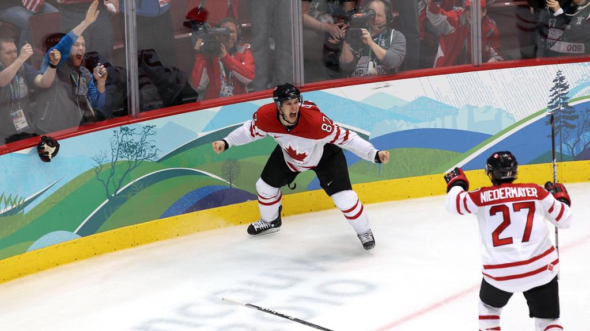

## The collector

My name is Domenic Fayad, AKA `goat.sportscards`.

Domenic Fayad.

## How it started

The first pack that I ever ripped was a pack of 2005-06 Upper Deck Black Diamond. 

Even though I had been collecting Pokemon since the early 2000s, my attention quickly shifted to hockey. 

Like many others, the 2005-06 NHL season reeled me in. Most of that is credit to rookie phenoms Sidney Crosby & Alexander Ovechkin who took the league by storm. 

During that season, I was hooked on hockey. I was hooked on the hobby of collecting.

These days I prefer to buy the card I'm after, but every now and then I give into the nostalgic craving of opening up a pack of cards.

## What I collect

I collect across a few sports, but my clear preference is Hockey. 

Like most Canadians, I have a strong connection with the sport since its what I grew up watching. I still get chills thinking of the "Golden Goal" at the Vancouver 2010 Olympic Winter Games.

Sidney Crosby's gold-medal winning goal at the Vancouver 2010 Olympics.

My collection has become specialized over the year. These days, I collect high-end hockey with a focus on short-printed rookie cards of generational players. To name a few, McDavid, Crosby, Ovechkin.

## Let's Connect!
Feel free to reach out.
* LinkedIn: [Domenic Fayad](https://www.linkedin.com/in/domenicfayad/)
* Twitter: [@domenic.fayad](https://twitter.com/domenicfayad)
* Instagram: [@goatsportscards](https://www.instagram.com/goat.sportscards/?hl=en)
* eBay: [@goat.sportscards](https://www.ebay.com/usr/goat.sportscards)

<figure data-behold-id="RQ2OsNjry7NSCDP3nNTa"></figure>

